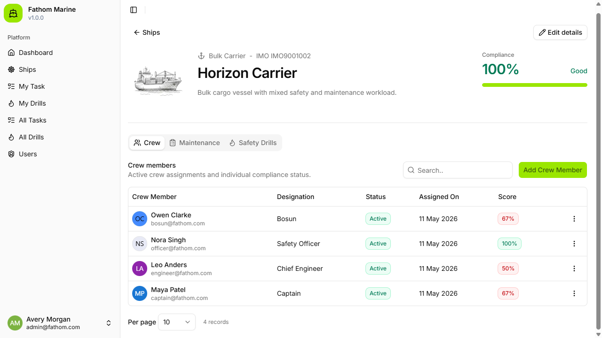

<a id="readme-top"></a>

<div align="center">

# Fathom Marine Assessment

Full-stack maritime operations and compliance system for managing ship maintenance, safety drills, crew activity, and compliance risk.

[![Next.js][next-shield]][next-url]
[![React][react-shield]][react-url]
[![FastAPI][fastapi-shield]][fastapi-url]
[![PostgreSQL][postgres-shield]][postgres-url]
[![Docker][docker-shield]][docker-url]

[Live Demo](https://fathom-asmt.vercel.app/) | [API Health](http://localhost:8000/health) | [Assessment Scope](docs/scope.md)

</div>



<details>
  <summary>Table of Contents</summary>
  <ol>
    <li><a href="#about-the-project">About The Project</a></li>
    <li><a href="#features">Features</a></li>
    <li><a href="#built-with">Built With</a></li>
    <li><a href="#architecture">Architecture</a></li>
    <li><a href="#getting-started">Getting Started</a></li>
    <li><a href="#demo-data">Demo Data</a></li>
    <li><a href="#development">Development</a></li>
    <li><a href="#project-structure">Project Structure</a></li>
    <li><a href="#api-surface">API Surface</a></li>
    <li><a href="#deployment">Deployment</a></li>
  </ol>
</details>

## About The Project

Fathom Marine Assessment is a role-aware maritime operations platform built for a software developer assessment. It helps a marine organization track operational readiness across ships by connecting maintenance tasks, safety drills, crew assignments, and compliance scoring in one dashboard.

The application supports admin workflows for managing ships, users, tasks, drills, and crew assignments, while crew members can view assigned work, update maintenance progress, and mark drill attendance.

<p align="right">(<a href="#readme-top">back to top</a>)</p>

## Features

- Ship registry with crew, maintenance, and drill views
- Role-based access for admin and crew workflows
- Maintenance task creation, assignment, status updates, due dates, and crew notes
- Safety drill scheduling, ship assignment, attendance tracking, and completion status
- Compliance dashboard for completed versus pending activity
- Automatic compliance refresh after task and drill changes
- Seeded demo users, ships, maintenance tasks, and drills
- Docker Compose setup for frontend, API, and PostgreSQL
- CI checks for backend tests, frontend build, and Docker image builds

<p align="right">(<a href="#readme-top">back to top</a>)</p>

## Built With

- [Next.js 16][next-url]
- [React 19][react-url]
- [TypeScript][typescript-url]
- [Tailwind CSS 4][tailwind-url]
- [shadcn/ui][shadcn-url]
- [FastAPI][fastapi-url]
- [SQLAlchemy][sqlalchemy-url]
- [Alembic][alembic-url]
- [PostgreSQL 16][postgres-url]
- [Docker Compose][docker-url]

<p align="right">(<a href="#readme-top">back to top</a>)</p>

## Architecture

```text
Browser
  |
  | Next.js app
  v
Frontend :3000
  |
  | REST API / JWT auth
  v
FastAPI :8000
  |
  | SQLAlchemy async driver
  v
PostgreSQL :5432
```

The frontend is a Next.js App Router application with reusable UI components, dashboard views, admin screens, and authenticated API calls. The backend is a FastAPI service using SQLAlchemy models, Alembic migrations, JWT authentication through FastAPI Users, and background compliance recalculation hooks.

<p align="right">(<a href="#readme-top">back to top</a>)</p>

## Getting Started

### Prerequisites

- [Docker Desktop][docker-url]
- [Node.js 22+][node-url]
- [Python 3.14+][python-url]
- [uv][uv-url]

### Run With Docker Compose

From the repository root:

```bash
docker compose up --build
```

This starts the complete local stack:

| Service | URL |
| --- | --- |
| Frontend | http://localhost:3000 |
| API | http://localhost:8000 |
| API docs | http://localhost:8000/docs |
| PostgreSQL | localhost:5432 |

### Run Locally

1. Create the backend environment file:

   ```bash
   cp src/backend/.env.example src/backend/.env
   ```

2. Start PostgreSQL locally, or use the database from Docker Compose.

3. Run the backend:

   ```bash
   cd src/backend
   uv sync --group dev
   uv run alembic upgrade head
   uv run fastapi dev app/main.py
   ```

4. Run the frontend in another terminal:

   ```bash
   cd src/fathom-frontend
   npm install
   npm run dev
   ```

5. Open http://localhost:3000.

<p align="right">(<a href="#readme-top">back to top</a>)</p>

## Demo Data

On first startup, the API seeds demo data when the database is empty:

- 5 users
- 5 ships
- Sample maintenance tasks
- Sample safety drills and assignments

All demo users use the password:

```text
admin123
```

Demo accounts:

| Role | Email |
| --- | --- |
| Admin | admin@fathom.com |
| Engineer | engineer@fathom.com |
| Captain | captain@fathom.com |
| Officer | officer@fathom.com |
| Bosun | bosun@fathom.com |

<p align="right">(<a href="#readme-top">back to top</a>)</p>

## Development

### Backend

```bash
cd src/backend
uv sync --group dev
uv run pytest
```

Create a migration:

```bash
uv run alembic revision --autogenerate -m "describe change"
```

Run migrations:

```bash
uv run alembic upgrade head
```

### Frontend

```bash
cd src/fathom-frontend
npm install
npm run lint
npm run build
```

<p align="right">(<a href="#readme-top">back to top</a>)</p>

## Project Structure

```text
.
|-- docs/
|   |-- scope.md
|   `-- screenshot.png
|-- src/
|   |-- backend/
|   |   |-- app/
|   |   |   |-- api/
|   |   |   |-- infra/
|   |   |   |-- schemas/
|   |   |   `-- services/
|   |   |-- pyproject.toml
|   |   `-- alembic.ini
|   `-- fathom-frontend/
|       |-- app/
|       |-- components/
|       |-- hooks/
|       `-- lib/
|-- docker-compose.yml
`-- README.md
```

<p align="right">(<a href="#readme-top">back to top</a>)</p>

## API Surface

The FastAPI service exposes REST routes for:

- `/auth` - login, registration, password reset, and user verification flows
- `/users` - user administration and search
- `/ships` - ship management, ship crew, ship tasks, and ship drills
- `/tasks` - task pagination and crew task updates
- `/drills` - drill listing, drill management, and crew drill views
- `/health` - service health check

When running locally, interactive API documentation is available at http://localhost:8000/docs.

<p align="right">(<a href="#readme-top">back to top</a>)</p>

## Deployment

The current demo is deployed at [fathom-asmt.vercel.app](https://fathom-asmt.vercel.app/). The repository also includes Dockerfiles for the frontend and backend plus a root `docker-compose.yml` for local orchestration.

CI runs on pushes to `main` and pull requests:

- Backend dependency install and tests
- Frontend dependency install and production build
- Docker Compose image build

<p align="right">(<a href="#readme-top">back to top</a>)</p>

[next-shield]: https://img.shields.io/badge/Next.js-16-000000?style=for-the-badge&logo=nextdotjs&logoColor=white
[next-url]: https://nextjs.org/
[react-shield]: https://img.shields.io/badge/React-19-61DAFB?style=for-the-badge&logo=react&logoColor=000000
[react-url]: https://react.dev/
[fastapi-shield]: https://img.shields.io/badge/FastAPI-0.111+-009688?style=for-the-badge&logo=fastapi&logoColor=white
[fastapi-url]: https://fastapi.tiangolo.com/
[postgres-shield]: https://img.shields.io/badge/PostgreSQL-16-4169E1?style=for-the-badge&logo=postgresql&logoColor=white
[postgres-url]: https://www.postgresql.org/
[docker-shield]: https://img.shields.io/badge/Docker-Compose-2496ED?style=for-the-badge&logo=docker&logoColor=white
[docker-url]: https://www.docker.com/
[typescript-url]: https://www.typescriptlang.org/
[tailwind-url]: https://tailwindcss.com/
[shadcn-url]: https://ui.shadcn.com/
[sqlalchemy-url]: https://www.sqlalchemy.org/
[alembic-url]: https://alembic.sqlalchemy.org/
[node-url]: https://nodejs.org/
[python-url]: https://www.python.org/
[uv-url]: https://docs.astral.sh/uv/
