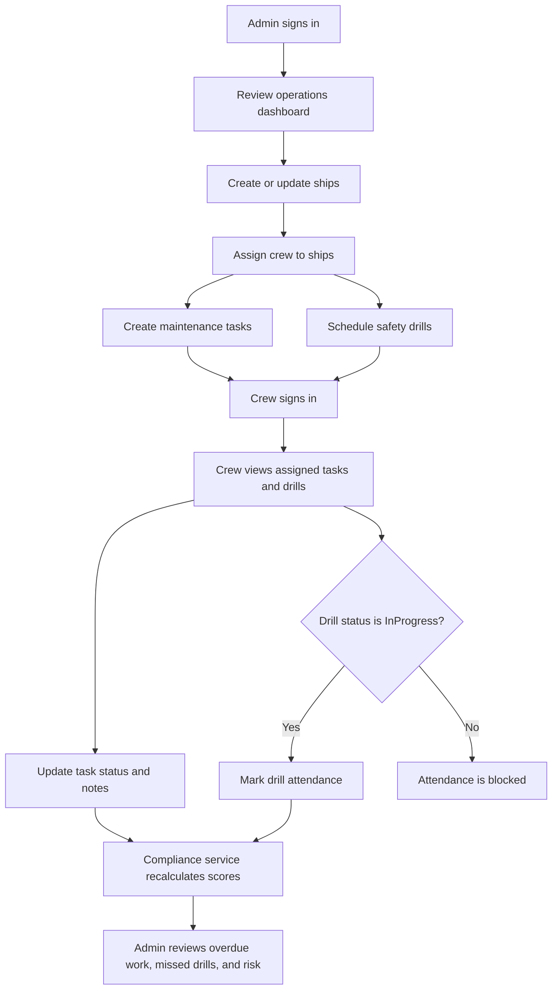
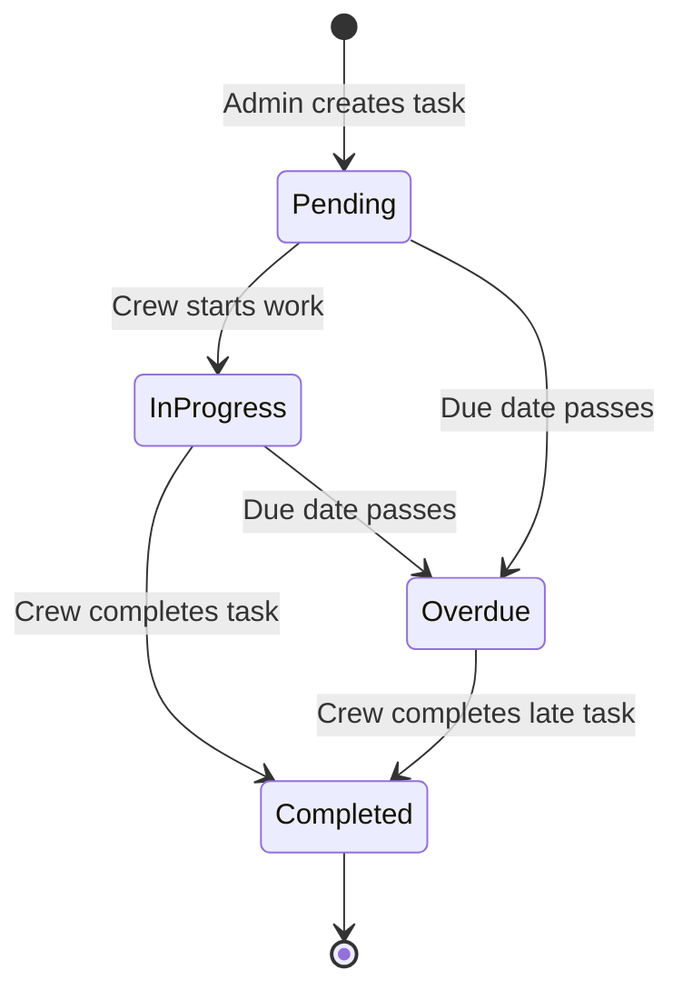
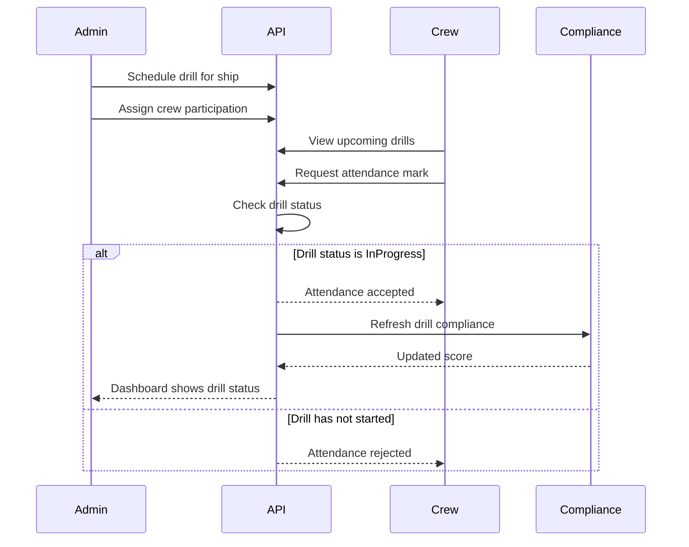
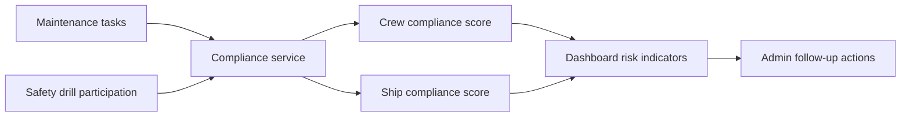

# Business Flow

This document describes the main operational flow for Fathom Marine Assessment, from admin setup through crew execution and compliance monitoring.

## Actors

- **Admin:** Manages ships, users, crew assignments, maintenance tasks, safety drills, and compliance review.
- **Crew:** Views assigned work, updates maintenance progress, and records drill attendance or completion.

## End-to-End Flow



1. Admin signs in and reviews the operations dashboard.
2. Admin creates or updates ships in the ship registry.
3. Admin assigns crew members to ships.
4. Admin creates maintenance tasks with due dates, priority, status, and assigned crew members.
5. Admin schedules safety drills for ships and assigns required crew participation.
6. Crew members sign in to their dashboard.
7. Crew members see only their assigned maintenance tasks and drills.
8. Crew updates maintenance task status as work moves from pending to in progress to completed.
9. Crew adds notes or comments to maintenance tasks when updates need supporting context.
10. Crew marks drill attendance only after the drill has started and its status is `InProgress`.
11. The backend recalculates compliance after maintenance and drill changes.
12. Admin monitors overdue maintenance, missed drills, pending activity, and compliance scores.
13. Admin uses compliance insights to follow up on risky ships, incomplete work, or missed safety activity.

## Maintenance Flow



```text
Admin creates task
  -> Task assigned to ship and crew member
  -> Crew views assigned task
  -> Crew updates status and notes
  -> Completed tasks improve compliance
  -> Overdue incomplete tasks reduce compliance
```

## Safety Drill Flow



```text
Admin schedules drill
  -> Drill assigned to ship and crew
  -> Crew views upcoming drill
  -> Drill status moves to InProgress when started
  -> Crew marks attendance only while drill is InProgress
  -> Completed participation improves compliance
  -> Missed drills reduce compliance
```

## Compliance Flow

Compliance is driven by maintenance completion and drill participation. When task or drill data changes, the backend refreshes compliance scores so admin dashboards can highlight operational risk.



```text
Maintenance activity + Drill activity
  -> Compliance service recalculation
  -> Ship and crew compliance scores
  -> Dashboard risk visibility
```
